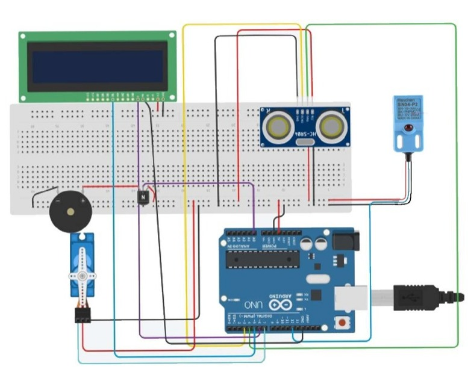

# Smart Trashbin with Metal Detector and Range Sensor

  

## Project Domain
 
 This project presents an Internet of Things (IoT) solution designed for disaster mitigation, specifically focusing on a Flood Early Warning System (EWS). It features real-time monitoring of river water levels, rainfall intensity, and environmental conditions (temperature and humidity) to bridge the information gap between upstream conditions and downstream residential areas. The system integrates digital notifications via Telegram and visual data tracking through the Thinger.io cloud platform to ensure residents can evacuate timely during extreme weather or nighttime. 

## Table Of Contents
- [Background](#background)
- [Prerequisites](#prerequisites)
- [System Diagrams](#system-diagrams)
- [Demo and Evaluation](#demo-and-evaluation)
- [Conclusion](#conclusion)
- [Team](#team)

---

## Background

### Problem Statements
1. Traditional flood monitoring relies on manual visual checks, which are ineffective and dangerous during heavy rain, extreme weather, or at night.
2. There is a critical lack of real-time information regarding sudden water level rises in upstream areas, often resulting in downstream residents being unaware of incoming floods until it is too late.
3. As a tropical country with high rainfall, Indonesia (particularly regions like Sumatra) faces frequent hydrometeorological disasters that cause significant material loss and fatalities due to delayed evacuation.
   
### Goals
1. Establish a real-time and remote data transmission mechanism from flood-prone locations to a centralized monitoring system to overcome visual limitations.
2. Achieve high accuracy and low latency in detecting water level increases and delivering emergency notifications to the community.
3. Implement a tiered warning system (Waspada, Siaga, Awas) to provide clear urgency levels for community response and evacuation.

### Solution Statements
1. Use an ESP32 microcontroller as the primary processing unit to handle multi-sensor data and Wi-Fi connectivity.
2. Incorporate an HC-SR04 ultrasonic sensor for precise water level measurement, a DHT-11 sensor for ambient temperature and humidity, and a rain sensor to detect precipitation.
3. Utilize the MQTT (Message Queuing Telemetry Transport) protocol for efficient data transmission to Thinger.io, providing a real-time web-based dashboard for remote monitoring.
4. Integrate a Telegram Bot API for immediate smartphone notifications and a physical buzzer for local audible alarms when water levels reach dangerous thresholds.

---

## Prerequisites

### Hardware Specifications

- **Microcontroller:** ESP32 DEV KIT v4
- **Sensors:** Temperature Sensor (DHT-11), Ultrasonic Sensor (HC-SR04), & Rain Drop Sensor
- **Actuators:** Buzzer
- **Connectivity:** WiFi
- **Power Supply:** Direct USB Cable

### ESP32 Datasheet

### Thinger.Io Interface

### Telegram Interface

## System Diagrams

1.  **Block Diagram**

    

2.  **Sequence Diagram**

    

3.  **Flow Diagram**

    

4.  **Schematic**

    

## Demo and Evaluation
### Demo Link : 

- **Setup:** The hardware assembly involves connecting the ESP32 unit to the HC-SR04 ultrasonic sensor, DHT-11 temperature and humidity sensor, rain sensor, and a buzzer for audible alarms. Specific pin assignments must be followed, including GPIO 4 for the DHT11, GPIO 18 and 19 for the ultrasonic sensor, GPIO 39 for the rain sensor, and GPIO 23 for the buzzer. Following assembly, the source code containing Wi-Fi credentials, Thinger.io device information, and Telegram Bot tokens is uploaded to the ESP32 to establish connectivity via the MQTT protocol.
- **Demo:** The demonstration highlights the system's ability to provide real-time environmental monitoring by acquiring data from sensors every 20 seconds. It showcases the live visualization of water levels and humidity on the Thinger.io dashboard as well as the automated activation of the local buzzer and Telegram notifications. The alerting mechanism is demonstrated by simulating different water levels to trigger classification statuses: Waspada for 0-10 cm, Siaga for 10-20 cm, and Awas for levels exceeding 20 cm.
- **Evaluation:** The system is evaluated based on its accuracy in status classification and its response speed, or latency, when detecting water level changes. Testing results confirm the system's reliability in sending sequential notifications to residents (for example, at 18:00 and 18:02) during critical status transitions. This evaluation confirms the device's robustness in bridging information gaps during nighttime or extreme weather, effectively increasing evacuation response times compared to manual monitoring methods.

## Conclusion
This IoT-based flood early warning system can save lives, property, and effort for communities living in disaster-prone areas. Its automatic monitoring features, utilizing high-precision sensors such as the HC-SR04 and DHT-11, provide significant benefits by bridging the information gap between upstream river conditions and downstream residential settlements. With this system, we can foster a safer living environment integrated with future technology, ensuring that critical environmental data is accessible even during extreme weather or nighttime conditions. As long as this system is implemented and maintained effectively, we can advance disaster mitigation strategies with more accurate techniques and provide greater security for the public to focus on their daily activities without the constant threat of undetected rising water levels.

## Team
1. fanTaux (https://github.com/fanTaux)
2. cayo-py (https://github.com/cayo-py)
3. RisangDananJoyo (https://github.com/RisangDananJoyo)
